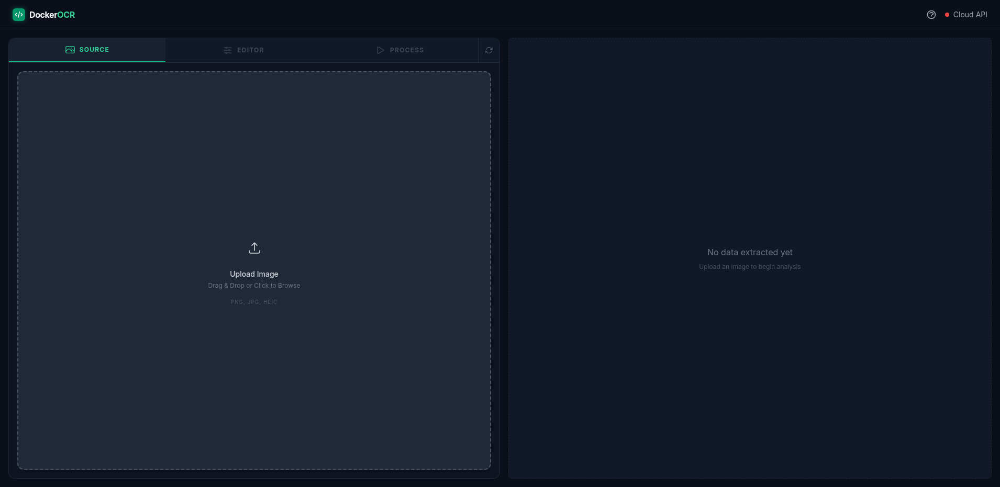
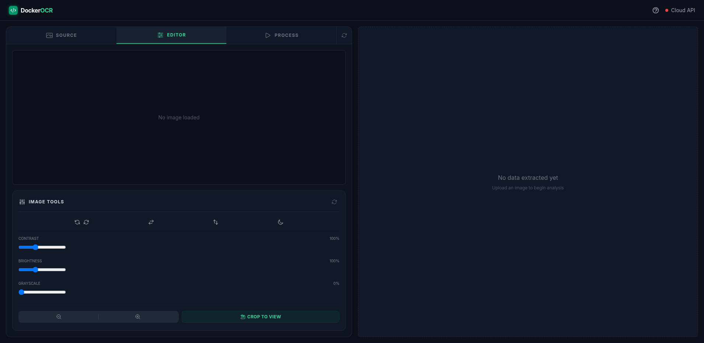
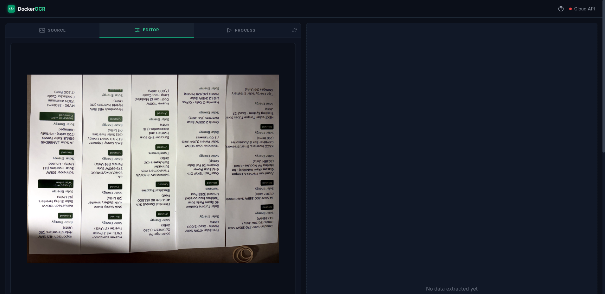
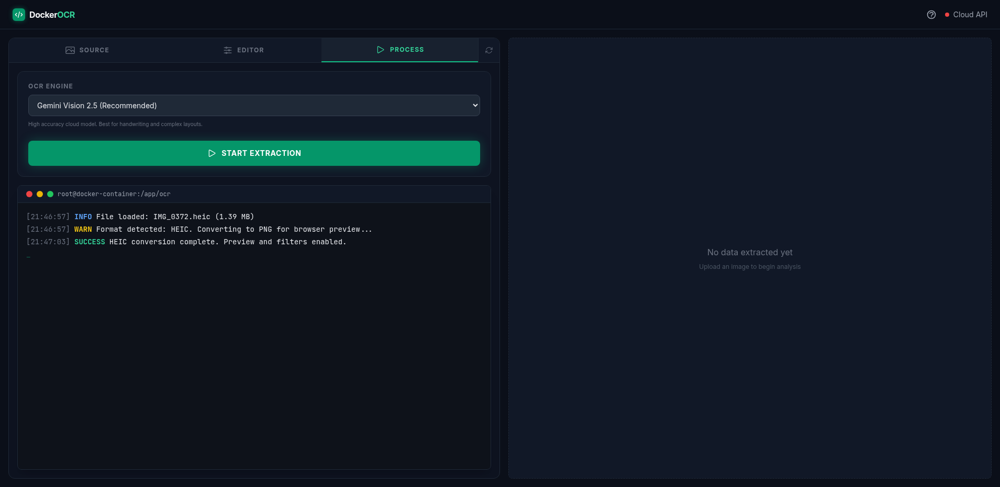
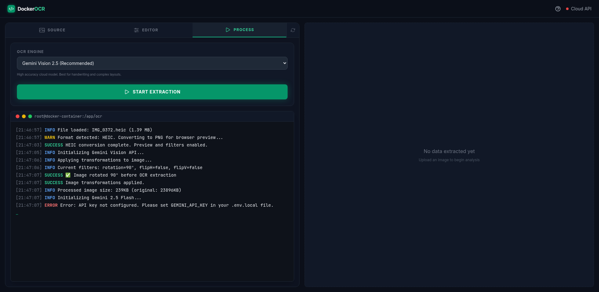

<div align="center">

# DockerOCR Dashboard

**A modern OCR application with dual-engine support: Gemini Vision API (cloud) and PaddleOCR (local Docker)**

[](https://swipswaps.github.io/DockerOCR/)
[](LICENSE)
[](https://reactjs.org/)
[](https://www.typescriptlang.org/)

</div>

---

## 📸 Screenshots

<div align="center">

### Main Interface

*Clean, modern dark theme interface with drag-and-drop file upload*

### Image Editor with Controls

*Live image preview with rotation, flip, filters, and zoom controls*

### OCR Processing

*Real-time terminal logs showing Docker container status during OCR extraction*

### Results View

*Extracted text with multiple export formats: JSON, Text, CSV, XLSX, SQL*

</div>

---

## ✨ Features

### 🖼️ **Image Processing**
- **HEIC Support**: Automatic conversion of iPhone HEIC images to PNG
- **Image Filters**: Adjust contrast, brightness, grayscale
- **Transformations**: Rotate (0°/90°/180°/270°), flip horizontal/vertical, invert colors
- **Zoom & Pan**: Interactive image viewer with zoom controls
- **Crop**: Select and crop regions of interest
- **Text Overlay**: Visual bounding boxes on extracted text with click-to-select

### 🤖 **Dual OCR Engines**

| Feature | Gemini Vision 2.5 | PaddleOCR |
|---------|------------------|-----------|
| **Location** | ☁️ Cloud API | 🐳 Local Docker |
| **Accuracy** | ⭐⭐⭐⭐⭐ Excellent | ⭐⭐⭐⭐ Very Good |
| **Speed** | ~3-5 seconds | ~2-3 seconds |
| **Privacy** | Data sent to Google | 100% local processing |
| **Setup** | API key required | Docker required |
| **Cost** | Free tier available | Free (self-hosted) |
| **Best For** | Handwriting, complex layouts | Simple documents, privacy |
| **Table Support** | ✅ Excellent | ✅ Good (column detection) |
| **Multi-language** | ✅ 100+ languages | ✅ English + others |

**Gemini Vision 2.5** (Cloud, Recommended)
- High accuracy for handwriting and complex layouts
- Best for multi-column tables and structured documents
- Requires Google Gemini API key
- Handles rotated text automatically

**PaddleOCR** (Local Docker)
- Privacy-focused, runs entirely on your machine
- Fast processing with table-aware text sorting
- No API key required
- Automatic column detection for multi-column tables
- Histogram-based column boundary detection

### 📊 **Export Formats**
- **JSON**: Full structured data with bounding boxes and confidence scores
- **Plain Text**: Extracted text with proper reading order
- **CSV**: Tabular format with text, confidence, and coordinates
- **XLSX**: Excel spreadsheet with formatted data
- **SQL**: INSERT statements for database import

### ⌨️ **Keyboard Shortcuts**
- `Ctrl+O` / `Cmd+O`: Open file
- `Ctrl+R` / `Cmd+R`: Reset workspace
- `Ctrl+Enter` / `Cmd+Enter`: Start OCR extraction
- `Shift+?`: Show help modal

### 🎨 **Modern UI**
- Dark theme with emerald accents
- Responsive design (desktop & mobile)
- Real-time Docker log streaming
- Interactive terminal with color-coded logs
- Drag-and-drop file upload

---

## 🚀 Quick Start

### Prerequisites

- **Node.js** 18+ ([Download](https://nodejs.org/))
- **Docker** (optional, for PaddleOCR) ([Download](https://www.docker.com/get-started))
- **Gemini API Key** (for cloud OCR) ([Get API Key](https://aistudio.google.com/app/apikey))

### Installation

1. **Clone the repository:**
   ```bash
   git clone https://github.com/swipswaps/DockerOCR.git
   cd DockerOCR
   ```

2. **Install dependencies:**
   ```bash
   npm install
   ```

3. **Set up environment variables:**
   ```bash
   # Create .env.local file
   echo "VITE_GEMINI_API_KEY=your_gemini_api_key_here" > .env.local
   ```

   Get your Gemini API key from: https://aistudio.google.com/app/apikey

4. **Start PaddleOCR Docker container (optional):**
   ```bash
   docker compose up -d

   # Verify it's running
   curl http://localhost:5000/health
   # Should return: {"status":"healthy","service":"PaddleOCR"}
   ```

5. **Run the application:**
   ```bash
   npm run dev
   ```

6. **Open in browser:**
   ```
   http://localhost:3000
   ```

---

## 📖 How to Use

### User Interface Overview

The application has a **two-column layout**:

#### **Left Column: Tabbed Interface**

1. **Source Tab** 📁
   - Upload images via drag-and-drop or file picker
   - Supports: JPG, PNG, HEIC, WebP, BMP, GIF
   - Shows file info: name, size, format
   - HEIC files are automatically converted to PNG

   
   *Source tab showing uploaded HEIC file with automatic conversion*

2. **Editor Tab** ✏️
   - **Top Half**: Live image preview with zoom/pan
   - **Bottom Half**: Image controls
     - **Rotation**: Rotate left/right (90° increments)
     - **Flip**: Horizontal/vertical flip
     - **Invert**: Invert colors
     - **Filters**: Contrast, brightness, grayscale sliders
     - **Zoom**: Zoom in/out buttons
     - **Crop**: Select and crop regions
   - **Text Mode**: After OCR, switch to text overlay mode to see bounding boxes

   
   *Editor tab with live preview and comprehensive image controls*

   
   *Image rotated 90° - rotation is applied before OCR extraction*

3. **Process Tab** ▶️
   - **OCR Engine Selector**: Choose between Gemini or PaddleOCR
   - **Start Extraction Button**: Begin OCR processing
   - **Terminal**: Real-time logs showing:
     - Image processing steps
     - Docker container status (for PaddleOCR)
     - OCR progress and results
     - Error messages with troubleshooting hints

   
   *Process tab with OCR engine selector and terminal ready for extraction*

   
   *Real-time Docker logs streaming during OCR processing*

   
   *Successful extraction with detailed logs and processing time*

#### **Right Column: Results View**

After OCR extraction, view results in multiple formats:

- **JSON**: Full structured data
- **Text**: Plain text extraction
- **CSV**: Comma-separated values
- **XLSX**: Download as Excel file
- **SQL**: Database INSERT statements

Each tab has a **Copy** button to copy content to clipboard.


*Results view showing extracted text blocks with confidence scores and bounding boxes in JSON format*

### Workflow Example

```
┌─────────────┐      ┌─────────────┐      ┌─────────────┐      ┌─────────────┐
│   Upload    │  →   │    Edit     │  →   │   Process   │  →   │   Export    │
│   Image     │      │   (Optional)│      │     OCR     │      │   Results   │
└─────────────┘      └─────────────┘      └─────────────┘      └─────────────┘
  • Drag-drop         • Rotate 90°         • Select engine     • JSON/Text
  • HEIC support      • Flip H/V           • Start extraction  • CSV/XLSX/SQL
  • Auto-convert      • Adjust filters     • View logs         • Copy/Download
```

#### Step-by-Step Guide:

1. **Upload an image**
   - Click "Choose File" or drag-and-drop
   - Wait for HEIC conversion if applicable
   - File info appears in Source tab

2. **Edit the image (optional)**
   - Switch to "Editor" tab
   - Rotate if the image is sideways (rotation is applied before OCR)
   - Adjust filters for better OCR accuracy (contrast, brightness)
   - Crop to focus on specific regions

3. **Run OCR extraction**
   - Switch to "Process" tab
   - Select OCR engine:
     - **Gemini Vision 2.5**: Best for complex layouts, handwriting, tables
     - **PaddleOCR**: Fast, private, local processing
   - Click "Start Extraction"
   - Watch real-time logs in the terminal

4. **View and export results**
   - Results appear in the right column
   - Switch between JSON/Text/CSV/XLSX/SQL tabs
   - Click "Copy" to copy to clipboard
   - Click "Download XLSX" to save as Excel file

5. **Select text on image (optional)**
   - Switch to "Editor" tab
   - Toggle to "Text" mode (eye icon)
   - Click and drag on the image to select text
   - Selected text is highlighted in the results

---

## 🔧 Configuration

### Environment Variables

Create a `.env.local` file in the project root:

```bash
# Required for Gemini Vision API
VITE_GEMINI_API_KEY=your_gemini_api_key_here
```

### Docker Configuration

The PaddleOCR server runs in a Docker container defined in `docker-compose.yml`:

- **Port**: 5000
- **Health Check**: Automatic health monitoring
- **Auto-restart**: Container restarts on failure
- **Models**: Downloads ~200MB on first run

---

## 🛠️ Troubleshooting

### Common Issues

#### 1. **PaddleOCR Container Not Starting**

**Symptoms:**
- Error: "PaddleOCR container is not running"
- Terminal shows: "Docker connection failed"

**Solutions:**

**Check if Docker is running:**
```bash
docker ps
```

**Start the container:**
```bash
docker compose up -d
```

**Check container logs:**
```bash
docker compose logs -f paddleocr
```

**Rebuild the container (if corrupted):**
```bash
docker compose down
docker compose build --no-cache
docker compose up -d
```

**Verify health:**
```bash
curl http://localhost:5000/health
```

---

#### 2. **"RuntimeError: could not execute a primitive"**

**Symptoms:**
- PaddleOCR extraction fails with primitive error
- Happens when running OCR multiple times quickly

**Solutions:**

**Restart the container:**
```bash
docker compose restart paddleocr
```

**Wait 30 seconds before retrying** - PaddleOCR needs time to initialize

**Check container memory:**
```bash
docker stats paddleocr-server
```
If memory usage is high, increase Docker memory limit in Docker Desktop settings.

---

#### 3. **HEIC Files Not Converting**

**Symptoms:**
- HEIC upload shows "Converting..." indefinitely
- Error: "HEIC conversion failed"

**Solutions:**

**Check browser compatibility** - HEIC conversion requires modern browsers:
- Chrome 94+
- Firefox 93+
- Safari 15+
- Edge 94+

**Try a different browser** or **convert HEIC to JPG manually** before uploading.

---

#### 4. **Gemini API Errors**

**Symptoms:**
- Error: "Gemini API key not configured"
- Error: "API quota exceeded"

**Solutions:**

**Check API key is set:**
```bash
cat .env.local
# Should show: VITE_GEMINI_API_KEY=...
```

**Restart dev server after changing .env.local:**
```bash
# Stop the server (Ctrl+C)
npm run dev
```

**Verify API key is valid:**
- Go to https://aistudio.google.com/app/apikey
- Check if key is active and has quota remaining

**Switch to PaddleOCR** if Gemini quota is exhausted.

---

#### 5. **Text Extraction is Jumbled or Out of Order**

**Symptoms:**
- Extracted text is not in reading order
- Multi-column tables are mixed up

**Solutions:**

**Use Gemini Vision API** - Best for complex layouts and tables

**For PaddleOCR:**
- The server includes **table-aware sorting** that detects columns
- Works best with clear column separation
- Try adjusting image contrast/brightness for better column detection

**Rotate the image** if it's sideways - OCR works best on upright text

---

#### 6. **Port 5000 Already in Use**

**Symptoms:**
- Error: "Bind for 0.0.0.0:5000 failed: port is already allocated"

**Solutions:**

**Find what's using port 5000:**
```bash
# Linux/Mac
lsof -i :5000

# Windows
netstat -ano | findstr :5000
```

**Stop the conflicting service** or **change PaddleOCR port:**

Edit `docker-compose.yml`:
```yaml
ports:
  - "5001:5000"  # Change 5000 to 5001
```

Then update the frontend to use the new port (if needed).

---

#### 7. **Build Errors**

**Symptoms:**
- `npm run build` fails with TypeScript errors
- Deployment to GitHub Pages fails

**Solutions:**

**Check TypeScript errors:**
```bash
npm run type-check
```

**Fix type errors** in the reported files

**Clear cache and rebuild:**
```bash
rm -rf node_modules dist
npm install
npm run build
```

---

### Docker Commands Reference

```bash
# Start PaddleOCR container
docker compose up -d

# Stop container
docker compose down

# View logs (real-time)
docker compose logs -f paddleocr

# Restart container
docker compose restart paddleocr

# Rebuild container
docker compose build --no-cache

# Check container status
docker ps

# Check container health
curl http://localhost:5000/health

# Execute command inside container
docker exec -it paddleocr-server bash

# View container resource usage
docker stats paddleocr-server
```

---

## 🏗️ Architecture

```
DockerOCR/
├── components/          # React components
│   ├── DockerSetupHelper.tsx
│   ├── HelpModal.tsx
│   ├── ImageControls.tsx
│   ├── ImagePreview.tsx
│   ├── ResultsView.tsx
│   ├── Terminal.tsx
│   └── TextOverlay.tsx
├── hooks/              # Custom React hooks
│   ├── useImageFilters.ts
│   ├── useKeyboardShortcuts.ts
│   └── useLogger.ts
├── services/           # API services
│   ├── dockerLogService.ts
│   ├── geminiService.ts
│   └── ocrService.ts
├── utils/              # Utility functions
│   └── imageProcessing.ts
├── paddle-server/      # PaddleOCR Docker server
│   ├── Dockerfile
│   ├── server.py       # Flask API with table-aware sorting
│   └── README.md
├── App.tsx             # Main application component
├── types.ts            # TypeScript type definitions
├── constants.ts        # Application constants
└── docker-compose.yml  # Docker configuration
```

### Technology Stack

- **Frontend**: React 19.2.0 + TypeScript 5.8.2
- **Build Tool**: Vite 6.2.0
- **OCR Engines**:
  - Google Gemini Vision 2.5 API
  - PaddleOCR 2.7.3 (Python)
- **Backend**: Flask (Python 3.9)
- **Image Processing**: Canvas API, heic2any, exifr
- **Export**: ExcelJS for XLSX generation
- **Containerization**: Docker + Docker Compose

---

## 🧪 Development

### Run Development Server

```bash
npm run dev
```

### Build for Production

```bash
npm run build
```

### Type Check

```bash
npm run type-check
```

### Preview Production Build

```bash
npm run preview
```

---

## 📦 Deployment

### GitHub Pages

The app is configured for GitHub Pages deployment:

1. **Build the app:**
   ```bash
   npm run build
   ```

2. **Deploy to GitHub Pages:**
   - Push to `main` branch
   - GitHub Actions will automatically build and deploy
   - Live at: `https://yourusername.github.io/DockerOCR/`

**Note**: PaddleOCR requires Docker and won't work on GitHub Pages. Use Gemini Vision API for the hosted version.

### Self-Hosted

1. **Build the app:**
   ```bash
   npm run build
   ```

2. **Serve the `dist` folder** with any static file server:
   ```bash
   npx serve dist
   ```

3. **Run PaddleOCR container** on the same machine:
   ```bash
   docker compose up -d
   ```

---

## 🤝 Contributing

Contributions are welcome! Please feel free to submit a Pull Request.

---

## 📄 License

This project is licensed under the MIT License.

---

## 🙏 Acknowledgments

- **PaddleOCR**: Open-source OCR toolkit by PaddlePaddle
- **Google Gemini**: Advanced vision AI model
- **React**: UI framework
- **Vite**: Fast build tool

---

## 📞 Support

- **Issues**: [GitHub Issues](https://github.com/swipswaps/DockerOCR/issues)
- **Live Demo**: [https://swipswaps.github.io/DockerOCR/](https://swipswaps.github.io/DockerOCR/)

---

<div align="center">
Made with ❤️ by the DockerOCR team
</div>
